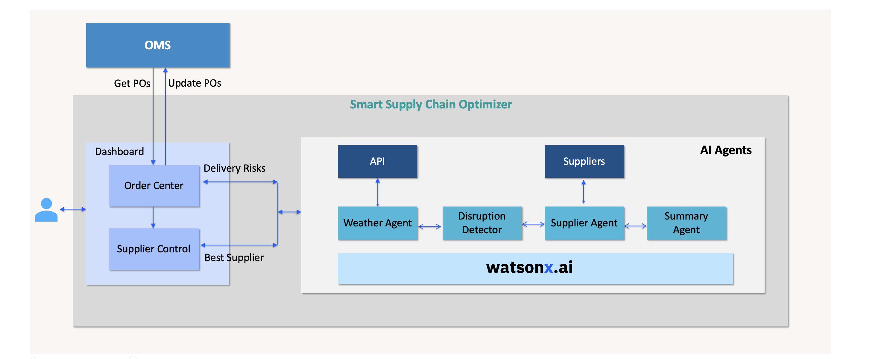

# SmartSupplyChainOptimizer
The Smart Supply Chain Optimizer, enhances the logistics through predictive analytics. Optimize operations, and increase supply chain resilience with AI-driven insights

#### Architecture



#### Home Page


## Prerequisite

Python 3.x should be installed and available.

## 1. Installation

#### 1.1 Download this repo

1. Download this repo (https://github.com/ibm-ecosystem-engineering/SmartSupplyChainOptimizer). 

2. Let's assume the repository has been downloaded, and available in the location `/Users/xyz/SmartSupplyChainOptimizer/src`.

    Let's call this as a root folder.

    Don't forget to replace the `/Users/xyz/SmartSupplyChainOptimizer/src` with your folder structure, wherever we refer in this document.

#### 1.2 Create Python virtual environment

1. Open a new command or terminal window.

2. Goto the repository root folder by running the below command.

    **Note:** Don't forget to replace the `/Users/xyz/SmartSupplyChainOptimizer/src` with your folder structure.

    ```
    cd /Users/xyz/SmartSupplyChainOptimizer/src
    ```

3. Create python `virtual environment` by running the below command.

    ```
    python -m venv myvenv
    source myvenv/bin/activate
    ```

4. Install the required python packages by running the below command.
    ```
    python -m pip install -r requirements.txt
    ```

#### 1.3 Create .env file

1. Create `.env` file with the below entries (you should be still in the root folder of the repo /Users/xyz/SmartSupplyChainOptimizer )

```
# Environment variables
LOGLEVEL = INFO

WATSONX_IBMC_AUTH_URL = "https://iam.cloud.ibm.com/identity/token"
WATSONX_CREDENTIALS_URL = "https://us-south.ml.cloud.ibm.com"
WATSONX_API_URL = "https://us-south.ml.cloud.ibm.com/ml/v1/text/generation?version=2023-05-29"
WATSONX_API_KEY = ""
WATSONX_PROJECT_ID = "53302198-522e-49a6-ba45-b445d46db666"
WATSONX_MODEL_ID_TEXT = "ibm/granite-3-8b-instruct"

```


2. Update the `WATSONX_API_KEY` property with your data.

They are weather API URL and key.

#### 1.4 Start the Python app

1. Run the below commands to start the app

    ```
    python main.py
    ```

2. Verify the app is working by opening the url  http://localhost:3001 in your browser.
